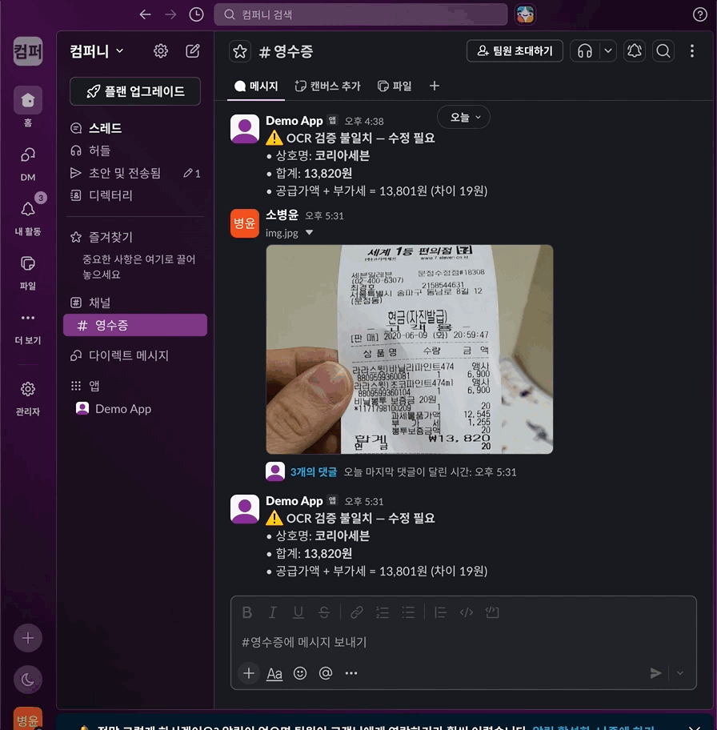
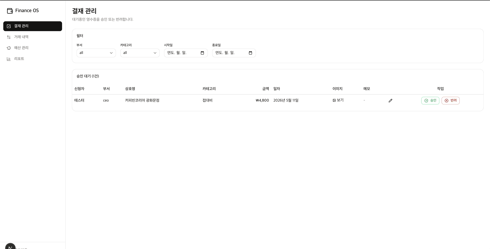
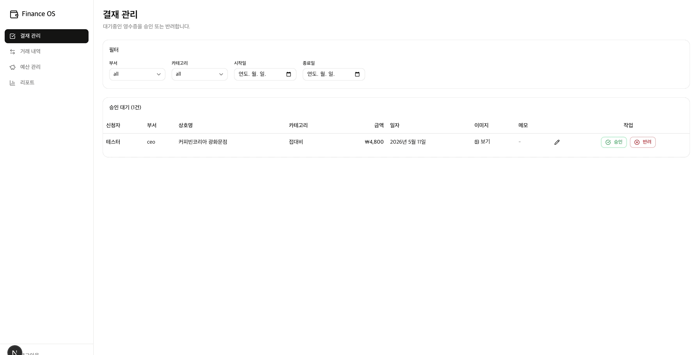
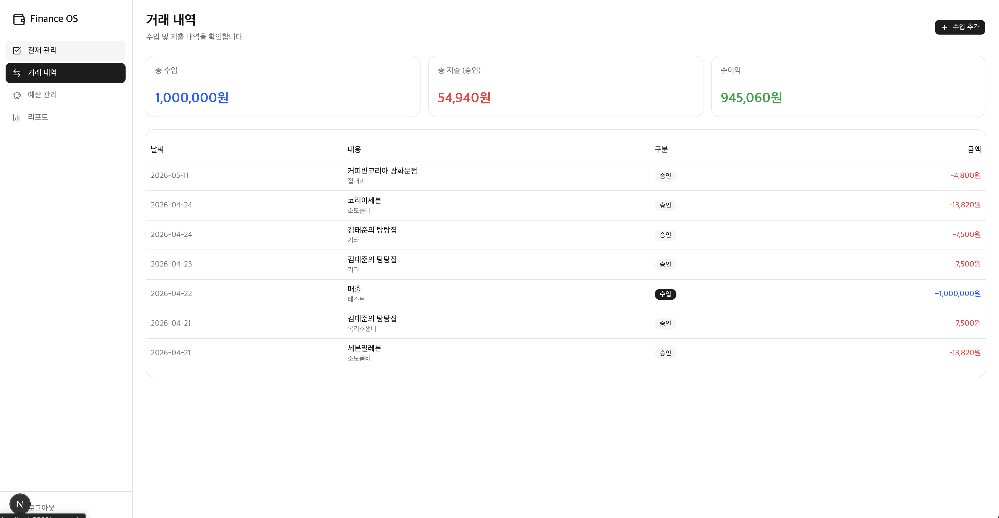
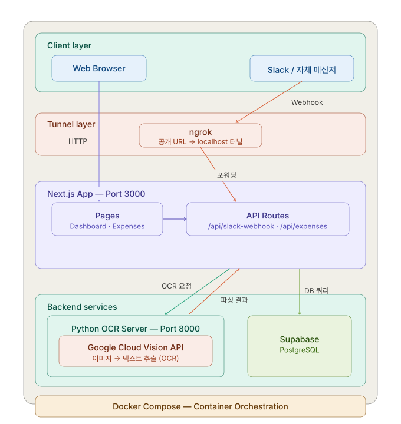

# 💰 Finance OS

> Slack에 영수증 사진 한 장 올리면 OCR이 자동으로 지출을 기록하는 개인 재무 관리 시스템

<details>
  <summary>1️. Slack 연동 시연</summary>
  
</details>

<details>
  <summary>2. 통계 대시보드 시연_영수증확인</summary>
  
</details>

<details>
  <summary>3. 통계 대시보드 시연_영수증처리</summary>
  
</details>

<details>
  <summary>4. 통계 대시보드 시연_완료</summary>
  
</details>


---

## 📌 프로젝트 소개

**Finance OS**는 영수증 촬영 한 번으로 지출이 자동 기록되는 재무 관리 앱입니다.

Slack 채널에 영수증 이미지를 올리면 Python OCR 서버가 Google Cloud Vision API를 통해 금액·가맹점명·거래일시를 추출하고, Supabase DB에 자동 저장합니다. 웹 대시보드에서는 카테고리별 지출 현황과 월간 추이를 한눈에 확인할 수 있습니다.

---

## ✨ 주요 기능

### 1. Slack 연동 지출 자동화
- Slack 채널에 영수증 사진 업로드 → Webhook으로 서버에 자동 전달
- ngrok으로 로컬 서버를 외부에 노출해 Slack Webhook 수신
- 처리 완료 후 Slack으로 파싱 결과 메시지 반환

### 2. Google Cloud Vision OCR
- Python OCR 서버가 Google Cloud Vision API를 호출해 영수증 이미지 분석
- 금액·가맹점명·거래 일시 자동 추출
- 이미지 전처리(그레이스케일·이진화·회전 보정)로 인식 정확도 향상

### 3. 지출 대시보드
- Recharts 기반 월간 지출 추이 그래프
- 카테고리별 지출 분류 및 통계
- Supabase 실시간 데이터 동기화

### 4. 가계부 수동 관리
- 지출 항목 직접 입력·수정·삭제
- 카테고리 태깅
- shadcn/ui + Tailwind CSS v4 반응형 UI

---

## 🏗️ 시스템 아키텍처



> **ngrok이 필요한 이유**
> Slack은 인터넷에 공개된 URL로만 Webhook을 전송할 수 있습니다.
> 로컬 환경의 `localhost`는 외부에서 접근이 불가하기 때문에 ngrok으로 공개 URL을 생성해 터널링합니다.
> Vercel 등 서버에 배포하면 ngrok 없이 동작합니다.

---

## 🛠️ 기술 스택

| 영역 | 기술 |
|------|------|
| **Frontend** | Next.js 16, React 19, TypeScript 5.9 |
| **UI** | shadcn/ui, Tailwind CSS v4, Recharts |
| **Backend** | Next.js API Routes |
| **Database** | Supabase (PostgreSQL) |
| **OCR** | Python, Google Cloud Vision API |
| **자동화** | Slack Bot API, Webhook, ngrok |
| **인프라** | Docker Compose |

---

## 🔄 Slack 연동 흐름

```
1. Slack 채널에 영수증 이미지 업로드
2. Slack이 ngrok 공개 URL로 Webhook 이벤트 전송
3. ngrok이 localhost:3000/api/slack-webhook으로 포워딩
4. Next.js API가 이미지를 Python OCR 서버(Port 8000)로 전달
5. OCR 서버가 Google Cloud Vision API 호출 → 금액·가맹점·날짜 추출
6. 추출된 데이터를 Supabase DB에 저장
7. Slack으로 파싱 결과 메시지 반환
8. 웹 대시보드에서 지출 현황 확인
```

---

## 🚀 로컬 실행 방법

### 사전 준비
- Node.js 20+
- Python 3.10+
- Docker & Docker Compose
- Supabase 프로젝트
- Slack App 및 Webhook URL 설정
- Google Cloud Vision API 키
- ngrok

### 환경변수 설정

`.env.local` 파일 생성:

```env
NEXT_PUBLIC_SUPABASE_URL=your_supabase_url
NEXT_PUBLIC_SUPABASE_ANON_KEY=your_supabase_anon_key
NEXT_PUBLIC_APP_URL=http://localhost:3000
SLACK_BOT_TOKEN=your_slack_bot_token
SLACK_SIGNING_SECRET=your_slack_signing_secret
GOOGLE_APPLICATION_CREDENTIALS=your_google_credentials_path
```

### 실행 순서

```bash
# 1. 저장소 클론
git clone https://github.com/2ma1995/Finance_OS.git
cd Finance_OS

# 2. OCR 서버 실행 (Docker)
docker-compose up -d

# 3. Next.js 앱 실행
npm install
npm run dev

# 4. ngrok으로 외부 URL 생성 (Slack Webhook용)
ngrok http 3000
```

ngrok 실행 후 출력되는 `https://xxxx.ngrok.io` URL을 Slack App의 Webhook URL로 등록하세요.

```
Slack App 설정 → Event Subscriptions → Request URL
https://xxxx.ngrok.io/api/slack-webhook
```

---

## 📁 프로젝트 구조

```
Finance_OS/
├── app/                # Next.js App Router 페이지
├── components/         # 재사용 UI 컴포넌트
├── lib/                # 유틸리티, Supabase 클라이언트
├── types/              # TypeScript 타입 정의
├── ocr-server/         # Python OCR 서버 (Google Cloud Vision)
├── docker-compose.yml  # OCR 서버 컨테이너 관리
└── proxy.ts            # 프록시 설정
```

---

## 🐳 Docker 구성

현재 `docker-compose.yml`은 **OCR 서버만** 컨테이너로 관리합니다.
Next.js는 별도로 `npm run dev` 또는 Vercel 배포로 실행합니다.

```yaml
services:
  ocr-server:
    build: ./ocr-server
    ports:
      - "8000:8000"
    environment:
      - ALLOWED_ORIGINS=${NEXT_PUBLIC_APP_URL:-http://localhost:3000}
    restart: unless-stopped
    healthcheck:
      test: ["CMD", "curl", "-f", "http://localhost:8000/health"]
      interval: 30s
      timeout: 10s
      retries: 3
```

---

## 📄 라이선스

MIT License
